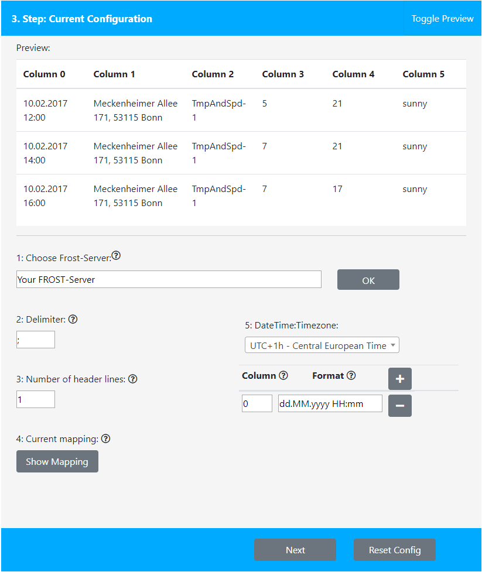
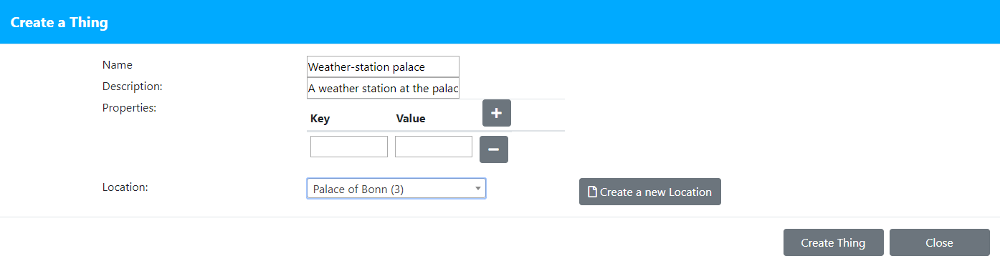
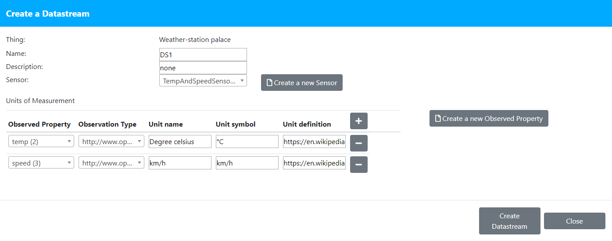

## An example

Imagine you have your own Frost-Server for sensor measurements. Unfortunately you have your old data stored in csv and excel files and now you want them online on your Frost-Server.
Thats the perfect usecase for ChillImport. This software provides you an easy to use GUI to select and import your old sensor data.

First download and install the program.

The csv-file you want to import is: Examplefile.csv

### Step 1 
(Tip: Open the log. It might help)
1.	select "File"
2.	then select the "examplefile.csv" file 
3.	Click "ok" (every time u choose a new source you have to click ok)

### Step 2
Here you have 2 Options:

1.	Choose a configuration

2.	Create a new configuration

We want to focus on option 2

### Step 3
Tip: Open the preview (Click on "Toggle Preview")

1.	At first you have to connect to your Frost-Server. For example: <http://chillimport-frost.docker01.justAnExample.de/v1.0>. \
	Click "OK".
   
2.	Choose the delimiter of the columns. Here it is the semicolon.

3.	In the first line of our file are no measurements.
	So we want to skip the first line. => Number of header lines = 1
   
4.	We skip the mapping for this file. We don´t want to map any measurements.

5.	Timezone: choose the timezone where the measurements were created  (eg. UTC+1).
	* The date and time in our file is stored in the first column (column 0) => Column = 0
	* The format is: dd.MM.yyyy HH:mm 
	* Please click "Next".

	
6.	Now we create a thing. The thing is our object where our measurements were created. It can be a weather-station, a smart home or something else. 
	1.	Click "Create Thing"
	2.	Give it a name, eg "Weather-station palace"
	3.	A short description: "A weather station at the palace of Bonn"
	4.	Create a location
		* Name: "Palace of Bonn"
		* Description: eg "The palace of Bonn"
		* Location in Coordinates: "50.7,7.1"
		* Click "Create Location"
	5.	Click "Create Thing"
	

	
7.	Create a Datastream
	1.	Name: "DS1"
	2.	Description: eg "none"
	3.	Create a Sensor. This is the sensor which created the measurements.
		1.	Name: "TempAndSpeedSensor1"
		2.	Description: eg "A temperature and windspeed sensor" This is a short description of the sensor.
		3.	Encoding Type: eg "application/pdf". This defines the file type of the Metadata.
		4.	Metadata: "example/link/123.pdf" The detailed description of the Sensor.
		5.	Click "Create Sensor"
	4.	Now we create a new "Observed Property" for the temperature
		1.	Name: "temp"
		2.	Description: "temperature"
		3.	Definition: eg <https://en.wikipedia.org/wiki/Temperature>
		4.	Click "Create Property"
	5.	Create a new "Observed Property" for the wind speed
		1.	Name: "speed"
		2.	Description: "wind speed"
		3.	Definition: <https://en.wikipedia.org/wiki/Wind_speed>
		4.	Click "Create Property"
	6.	Fill the first row of the table for the temperature observation
		1.	select "temp"
		2.	The observation type is an integer
		3.	Unit name is "Degree celsius"
		4.	Unit symbol: "°C"
		5.	Unit definition: <https://en.wikipedia.org/wiki/Celsius>
	7.	click "+" and do the same (7.6) for the wind speed
		1.	select "speed"
		2.	Obseravtion Type: Integer
		3.	Unit name: "km/h"
		4.	Unit symbol: "km/h"
		5.	Unit definition: <https://en.wikipedia.org/wiki/Kilometres_per_hour>
	8.	Click "Create Datastream" This will create a new MultiDatastream on the FROST-Server. 
	

	
8.	Add a DS and select the new created 
	1.	°C: Column = "3"
	2.	km/h: Column = "4"
	
9.	Save the Configuration

### Step 4
Click Import

You should have 2 skipped rows. This should be the two "Offline" rows.
The Frost-Server now has 34 observations (0 to 33).
You can check this by opening your Frost-Server in your Browser. 