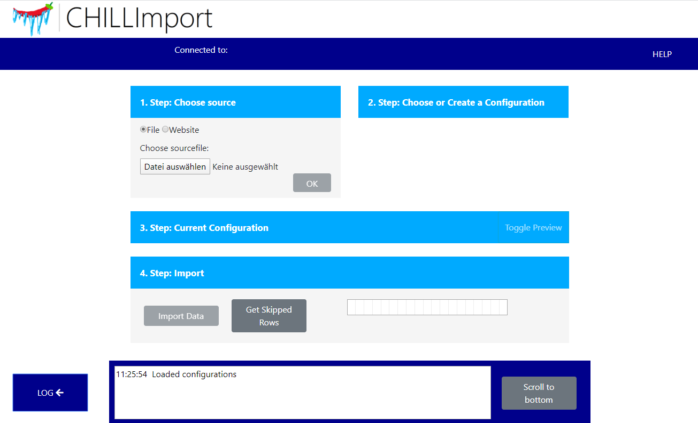

# ChillImport    

</img>\
ChillImport is a Software with which you can easily import your sensor measurements
from csv or excel files \
into a [FROST-Server](https://github.com/FraunhoferIOSB/FROST-Server). It offers
you an userfriendly, web-based gui.

## Downloading

The easiest way to obtain and run the software is docker:\
<https://hub.docker.com/r/fraunhoferiosb/chillimport>

If you've Docker installed, simply run
`docker run -p 8000:8000 fraunhoferiosb/chillimport` and you can access
ChillImport on [http://localhost:8000](http://localhost:8000).

## Setup

Before starting the software you have to create an environment-variable
"configPath", \
it defines the path to your configuration and log-files. By default the path is "/data".
\
\
To use this software you need a FROST-Server.\
For more details visit the
[FROST-Server github page](https://github.com/FraunhoferIOSB/FROST-Server).

## Importing Data

ChillImport offers you an easy and guided usage for all your imports. \
It is possible to import data from excel and csv files.\
If needed you can also create new entities on your FROST-Server, eg:

- Things
- Locations
- Datastreams
- Sensors
- Observed-Properies

This makes the use of ChillImport more convenient. \
\

For more information you can find example-imports here:
[ChillImport example](Example/ImportExample01.md)

## Screenshot

